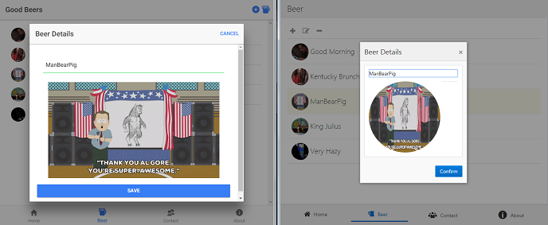

# jet-hello-world

The Oracle JET client alternative for Matt Raible's Angular/Ionic sample:

https://github.com/stormpath/stormpath-spring-boot-ionic-example

The backend is the Spring Boot server created by Matt above.

On the left is Matt's app, on the right is mine:

Here's the structure of the app:

To do:
- Functionality for adding new beers, with button in toolbar.
- Functionality for updating the name of an existing beer.
- Use Matt's icons for buttons along the bottom.
- Put 'Good Beers' in title bar instead of 'Beer'.
- Incorporate validation to show how easily JET supports that.
- Incorporate internationalization to show how easily JET supports that.
- Incorporate theming to show how easily JET supports that.
- Incorporate web components (i.e., CCA components) to show how easily JET supports that.
- Incorporate TypeScript, as in Matt's code.
